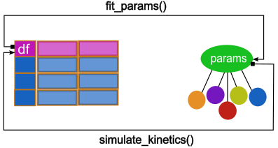

# enzymeR <a href="https://github.com/silvertaqman/enzymeR"></a>

## Overview

**Determination of parameters for Michaelis-Menten Dynamics and more**

Individual biochemical reactions are a useful method when critical metabolic points are needed. This package aims to fully characterize kinetical and thermodynamic properties of irreversible metabolic enzymes throught deriving a Michaelis-menten like rate equation, parameters and plots for tidy datasets. Also, there are functions and options to add:

- Reversibility,
- the usual five kinds of inhibition,
- binding of inhibitors to enzyme,
- substrate inhibition
- inhibition by binding to substrate
- Binding of ligands to proteins
- the Hill equation and
- the *Monod-Wynad-Changeaux* rate expression for enzymes with sigmoid kinetics. 

If you want to colaborate just ask for pull requests.

## Installation

## Usage

<a href="https://github.com/silvertaqman/enzymeR"></a>

### fit_params()

The general sintaxis works with a relational, or tidy, dataset with the following structure with suggested units:

- *t*: time for kinetic determination [min]
- *S*: substrate concentration data [mM],
- *v*: reaction rate [mM/min]

Even if these variables are often measured within enzymatic kinetical experiments, only two of them are truly useful to fit parameters. You shoud choose the "time" options if your model data, usually at your excel file, has only time and Substrate concentration. If you calculated or measured reaction rate then choose "rate". Finally, choose a linearization method . Then, the function must be run:
```
fit_params(df, model="time", method="lb")
```
This implementation allows to get a non-linear regression method with base on ... 

### simulate_kinetics()
You should provide a list with a set of parameters and a certain mode of operation:
- *K_m*: Concentration to get half of maximum rate
- *V_{max}*: Maximum reaction rate for enzymatic catalysis
- *K_i*: Inhibitor concentration constant
- *K_a*: Activator concentration constat

### kinetic_plots()
This function allows to get every linearization plot and the direct plot method. Also, the Time-Substrate and Substrate-Rate plot are showed.
